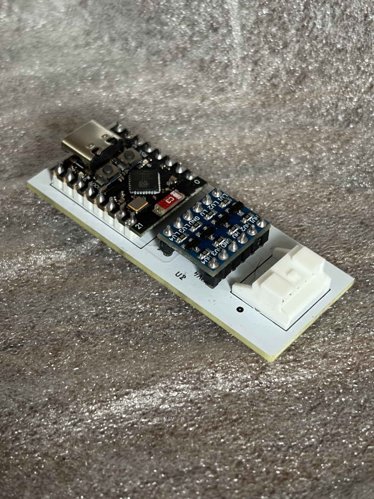

# Controller hardware

This project can run on a hand-assembled interface board built around an
ESP32-C3 SuperMini and a CYT1076 four-channel bidirectional logic-level module.
The carrier PCB connects the ESP32 UART to the Toshiba five-pin accessory
connector while keeping the module compact enough to install at the indoor
unit.

The fabrication archive in
[`hardware/gerbers/ToshibaEsphomeAdaptor-gerbers.zip`](../hardware/gerbers/ToshibaEsphomeAdaptor-gerbers.zip)
is the corrected, working PCB revision. It produces a 23.05 mm × 57.55 mm,
two-layer, 1.6 mm bare board. It supersedes an early prototype whose 3.3 V and
GND connections were transposed.

## Ordering the bare PCB

Upload the Gerber ZIP directly to the board fabricator. Before ordering, confirm
that its preview reports a 23.05 mm × 57.55 mm, two-layer, 1.6 mm board and that
the outline, plated holes, solder masks and both silkscreens are present. Do not
substitute files from the earlier transposed-rail prototype. The archive is for
bare-board fabrication; it is not a turnkey assembly package and contains no
pick-and-place or component-placement file.

For revision verification, the SHA-256 digest of the supplied archive is
`ab71ed31afc6234bcb570bde6412a8f4ee3f0c7e71fd45c88a65931f23e65ff4`.

## Known-good components

| Quantity | Component | Part/source |
|---:|---|---|
| 1 | ESP32-C3 SuperMini | [Tencent ESP32-C3 SuperMini](https://a.aliexpress.com/_EGqsCum) |
| 1 | Four-channel bidirectional level shifter | [CYT1076, 3.3–5 V](https://amzn.eu/d/09fd7ZLU) |
| 1 | Five-pin Toshiba-side board connector | [JST S05B-PASK-2(LF)(SN)](https://a.aliexpress.com/_Ew6u5H4) |
| 1 | Corrected carrier PCB | Gerber archive linked above |

This board was designed and tested with the linked Tencent ESP32-C3
SuperMini, which is the recommended version for this project. That
recommendation reflects the author's selection and successful experience with
it; other variants have not been evaluated.

The photograph above shows a hand-soldered example of the corrected, working
board. The USB-C end of the ESP32-C3, the CYT1076 module and the keyed JST
connector should face the orientations printed on the carrier PCB.

The PCB silkscreen marks the component pin names and the key orientation of the
modules and connector. Follow those markings: marketplace module names alone
are not a substitute for checking orientation before soldering.

## Assembly

1. Identify the corrected PCB and inspect it for manufacturing damage.
2. Dry-fit the ESP32-C3, CYT1076 and JST connector. Confirm every marked pin
   aligns with the corresponding module pin before applying solder.
3. Solder the lowest-profile part first, followed by the remaining modules and
   connector. Keep each module square to the carrier so the assembly fits the
   available space at the IDU.
4. Inspect every joint for bridges, incomplete wetting and pins accidentally
   soldered into the neighbouring hole.
5. Before fitting the ESP32-C3 or connecting an IDU, use a multimeter to check
   that the marked supply and ground rails are not shorted.
6. Flash and test the ESP32 from USB before connecting the Toshiba cable.
7. With the IDU isolated from mains, connect the correctly keyed cable to the
   JST socket. Do not insert or remove the interface while the IDU is powered.

## Electrical caution

The Toshiba accessory connection provides power and UART signalling from
equipment connected to mains. Isolate the indoor unit before opening it or
connecting/disconnecting the interface. Verify the connector orientation and
the PCB silkscreen rather than assuming wire colours or a pin order from a
photograph.

The supplied Gerbers are sufficient to reproduce the tested bare PCB. Editable
KiCad sources are not currently included, so changes to the circuit should be
treated as a new hardware revision and independently reviewed and tested.
